<div align="center">

# cloudctl

**One CLI for AWS, Azure, and GCP — with an AI agent that actually investigates, and fixes what it finds.**

*AI investigation & remediation: AWS today — Azure/GCP on the roadmap.*

[](https://pypi.org/project/cctl/)
[](https://pypi.org/project/cctl/)
[](https://github.com/cloudctlio/cloudctl/actions/workflows/security.yml)
[](LICENSE)

<br/>



<br/>

```bash
pip install "cctl[ai]"
```

</div>

---

## Why cloudctl?

Most cloud CLIs are thin wrappers around vendor APIs. cloudctl is different in one key way: **`cloudctl debug`** runs a real investigation.

Instead of returning raw API data and leaving diagnosis to you, it measures the symptom first, spawns three parallel hypothesis branches — each carrying **falsifiable predictions** it must test against real data — then discriminates, synthesizes, and critiques the findings before surfacing a single answer with IaC-aware fix steps. A hypothesis whose prediction is refuted is eliminated in code, not by prompt: no evidence, no diagnosis.

With `--resolve` it goes one step further: it writes the minimal IaC fix on a branch, validates it, and opens a PR — pausing for your approval before any file is touched and again before anything is pushed.

```
cloudctl debug --agent "payments service returning 502s since 3pm"
```

No log-grepping. No tab-switching. One command.

---

## Install

```bash
# Core CLI — all three clouds, no AI
pip install cctl

# With AI debug + ask (recommended)
pip install "cctl[ai]"

# With MCP server for Claude Desktop / Cursor
pip install "cctl[mcp]"

# Everything
pip install "cctl[all]"
```

---

## Quick Start

```bash
# Auto-detects your existing AWS/Azure/GCP credentials — no prompts
cloudctl init

# Query all clouds at once
cloudctl compute list --cloud all
cloudctl cost summary --cloud all
cloudctl security audit --cloud all

# Target a specific account
cloudctl database list --account prod --cloud aws

# Diagnose an incident with the AI agent
cloudctl debug --agent "ECS service unhealthy after last deploy"
```

---

## cloudctl debug

The flagship command. Give it a symptom — it fetches real data, runs parallel hypothesis branches, and returns a root cause with steps tailored to how you deployed.

### How the agent works

```
symptom
  │
  ▼
observe ──── measures the symptom in real data first: is it observable
  │          right now? when did it start (onset)? what exactly is affected?
  ▼
triage ───── generates 3 competing hypotheses, each with FALSIFIABLE
  │          PREDICTIONS: what MUST be observable if this hypothesis is true
  ▼
investigate (parallel)                        log intelligence (parallel)
  ├── branch 1: config check → operational      surveys every recently active
  ├── branch 2: config check → operational      log group; clusters lines into
  └── branch 3: config check → operational      templates and counts them
  │       each branch must TEST its predictions:
  │       CONFIRMED quotes are verified against fetched
  │       data in code — a fabricated test result is voided
  ▼
discriminate ─ causal rules: a refuted prediction ELIMINATES its hypothesis;
  │            a defect equally present while the system worked cannot be
  │            the cause; deployment noise before onset is discarded
  ▼
synthesize ─── confidence is calibrated from prediction outcomes in code:
  │            zero verified confirmations = LOW, no matter how confident
  │            the narrative sounds
  ▼
critique ───── devil's advocate: symptom-shape match, deployment noise,
  │            dependency coverage, permanence, untested claims
  ▼
root cause + calibrated confidence + IaC-aware fix steps
  │
  ▼
verdict prompt — was this correct? (feeds the live learning loop)
  │
  ▼ (--resolve)
resolution agent — writes the minimal IaC fix on a branch, validates,
                   opens a PR — gated by TWO operator approvals:
                   ① the fix plan (what changes, where) before any write
                   ② the real diff + passing validation before any push
```

Each branch checks **configuration state first** (enabled flags, bound ARNs, rule counts — the same order a human SRE would), then operational state. The core discipline is scientific: no hypothesis ships as the root cause unless a discriminating prediction was tested and confirmed against fetched data — and none refuted. When nothing survives testing, the honest answer is "not proven," at LOW confidence, instead of a plausible-sounding story.

### Deep service analysis, any service

The agent isn't limited to pre-built integrations. Alongside dedicated tools (logs, metrics, CloudTrail, config, deployment detection) it has:

- **`aws_read`** — call any read-only AWS API on any service; mutating operations are blocked in code, not by prompt. The agent plans its own deep-dive for services it has never seen.
- **`probe_permission`** — deterministic IAM policy simulation: a permission hypothesis becomes a measurement, no traffic or logs needed.
- **`get_dependency_graph`** — the real topology of your deployment, derived from one generic rule: a resource whose live configuration references another depends on it.
- **Log template mining** — every log fetch includes a frequency table of line *shapes*, so a flood of 5,000 near-identical lines is a counted fact, not something a 50-line sample might miss.
- **Metric baselines** — any metric can be compared against the same window hours or days earlier: "is this anomalous?" becomes arithmetic, not judgment.

### Deployment detection

cloudctl identifies how a resource is managed and tailors fix steps to your tooling:

| Detected via | Tooling |
|---|---|
| CloudFormation stack membership | CDK, CloudFormation |
| Terraform state tags | Terraform, OpenTofu |
| CloudTrail `CreateChangeSet` events | CloudFormation |
| CloudTrail user-agent analysis | Terraform, CDK, console/manual |

Azure (ARM/Bicep) and GCP (Deployment Manager) detection land together with agent support for those clouds.

### Gets smarter over time

Every confirmed diagnosis is stored locally. On repeat incidents, cloudctl pattern-matches against past confirmed fixes and can promote confidence automatically — so the third time you diagnose the same class of misconfiguration, it converges faster.

```bash
# Confirm a diagnosis was correct — stored for future pattern matching
cloudctl debug --agent --verdict y "ECS tasks crashing after deploy"

# Pass verdict non-interactively in scripts / run loops
cloudctl debug --agent --verdict skip "..."
```

---

## Commands

### Infrastructure

| Command | What it does |
|---|---|
| `cloudctl compute list/describe/stop/start` | VMs, Lambda, Cloud Run, ECS, GKE |
| `cloudctl storage list/describe/ls/du` | S3, Blob Storage, GCS |
| `cloudctl database list/describe/snapshots` | RDS, Azure SQL, Cloud SQL |
| `cloudctl network vpcs/security-groups/lb` | VPCs, NSGs, load balancers, DNS |
| `cloudctl containers list/describe` | ECS, AKS, GKE, ECR, ACR |
| `cloudctl iam roles/users/check` | IAM roles, users, permission checks |
| `cloudctl security audit/public-resources` | Security posture and misconfigs |
| `cloudctl cost summary/by-service` | Cost breakdown across clouds |
| `cloudctl pipeline list/analyze` | CodePipeline, Azure DevOps, Cloud Build |
| `cloudctl monitoring alerts/metrics` | CloudWatch, Azure Monitor, GCP Monitoring |
| `cloudctl messaging topics/queues` | SQS/SNS, Service Bus, Pub/Sub |
| `cloudctl backup list/status` | Backup jobs across clouds |
| `cloudctl find <query>` | Search resources by name, tag, or type |
| `cloudctl diff <resource>` | Detect IaC drift |

### AI (requires `pip install "cctl[ai]"`)

| Command | What it does |
|---|---|
| `cloudctl debug "<symptom>"` | Parallel hypothesis investigation → root cause + fix |
| `cloudctl debug --agent "<symptom>"` | Full agentic mode: triage → investigate → synthesize → critique |
| `cloudctl debug --agent --verdict y/n "<symptom>"` | Diagnose and record whether the answer was correct (trains the learning loop) |
| `cloudctl debug --agent --json-out result.json "<symptom>"` | Save structured JSON output alongside the rendered result |
| `cloudctl debug --agent --resolve --iac-root <dir> "<symptom>"` | After a confirmed diagnosis: write the minimal IaC fix on a branch, validate, open a PR — with two operator approval gates (fix plan; diff + validation) |
| `cloudctl debug ... --resolve --yes` | Skip the approval gates (CI use). Non-interactive runs without `--yes` stop safely at the first gate |
| `cloudctl ask "<question>"` | Answer cloud questions from live data |
| `cloudctl ask --interactive` | Multi-turn chat, context preserved |
| `cloudctl feedback list/accuracy` | Review AI answer history and accuracy |

### Setup

| Command | What it does |
|---|---|
| `cloudctl init` | Auto-detect credentials, enable all found clouds |
| `cloudctl accounts list/verify/use` | Manage cloud accounts and profiles |
| `cloudctl config get/set/list` | Manage cloudctl configuration |

---

## MCP Server

Works with Claude Desktop, Cursor, and any MCP-compatible client.

```bash
pip install "cctl[mcp]"
cloudctl mcp config    # prints config block for claude_desktop_config.json
cloudctl-mcp           # start the server
```

Once connected, your AI client can query your cloud directly:

> *"What's prod's cost breakdown this month?"*
> *"List all ECS services with CPU > 80%"*
> *"Show me recent pipeline failures"*

---

## How It Works

- **No new auth** — reads `~/.aws/config`, `~/.azure/`, `~/.config/gcloud/` as-is
- **Auto output format** — Rich tables in terminal, clean JSON when piped (`| jq`)
- **Multi-account** — `--account prod` fuzzy-matches any profile name or account ID
- **Multi-cloud** — `--cloud all` queries AWS + Azure + GCP in parallel
- **AI is optional** — all CLI commands work without `cctl[ai]`; only `debug` and `ask` need it
- **Read-only by default** — the agent's tools cannot mutate anything; the only write path is `--resolve`, which is gated behind operator approvals
- **Secrets stay out of context** — tool output is scrubbed by value shape (key formats, JWTs, PEM blocks) before the model or your terminal sees it
- **Crash-safe investigations** — progress checkpoints to SQLite; a run killed mid-flight (expired SSO token, Ctrl-C) resumes from its last completed step via `CLOUDCTL_RESUME_THREAD=<thread id from the report>`
- **Record & replay** — set `CLOUDCTL_RECORD=file.jsonl` to capture every tool call of an investigation; `CLOUDCTL_REPLAY=file.jsonl` re-runs the reasoning against that frozen evidence — an audit trail and a regression harness in one

---

## Cloud Support

| | AWS | Azure | GCP |
|---|:---:|:---:|:---:|
| CLI commands | ✅ Tested | ⚠️ Implemented, untested | ⚠️ Implemented, untested |
| MCP server | ✅ Tested | ⚠️ Implemented, untested | ⚠️ Implemented, untested |
| AI debug (`cloudctl debug`) | ✅ Full | 🚧 Roadmap | 🚧 Roadmap |
| AI resolution (`--resolve`) | ✅ Full | 🚧 Roadmap | 🚧 Roadmap |

AWS is the validated path today — the AI agent is exercised against live fault-injection environments. Azure/GCP provider code exists for the CLI/MCP layer but hasn't been validated against real subscriptions/projects yet; treat it as experimental. The investigation architecture itself (measure → predict → test → veto) contains no AWS-specific reasoning — Azure/GCP agent support is a matter of porting the tool layer (log/metric/config/audit fetchers), not the agent.

---

## AI Provider Support

`cloudctl debug` and `cloudctl ask` work with any Claude deployment:

| Provider | Config |
|---|---|
| AWS Bedrock (Claude) | `cloudctl config set ai.provider bedrock` |
| Anthropic API | `cloudctl config set ai.provider anthropic` |
| Azure AI Foundry | `cloudctl config set ai.provider azure_foundry` |
| Google Vertex AI | `cloudctl config set ai.provider vertex` |

```bash
cloudctl config set ai.provider bedrock
cloudctl config set ai.model anthropic.claude-sonnet-4-6-v1
```

---

## Credentials

cloudctl never stores credentials. It reads what you already have:

```bash
aws configure --profile prod        # AWS
az login                            # Azure
gcloud auth application-default login  # GCP
```

---

## Known Limitations

- **CloudTrail lag** — AWS management events take up to 15 minutes to appear. If you run `cloudctl debug` immediately after a config change, the triggering event may not be visible yet.
- **ALB access logs** — Log analysis requires `access_logs.s3.enabled = true` on the load balancer. Falls back to CloudWatch metrics otherwise.
- **CloudWatch Logs retention** — Searches the last 3 hours by default. Log groups with shorter retention will return no results.
- **Cross-account resources** — Operates within a single AWS account per run. Cross-account resources require separate `--account` invocations.
- **IaC detection requires audit trail** — Terraform/CDK/CloudFormation detection relies on CloudTrail. If CloudTrail is off or events have aged out, deployment method shows as `unknown`.

---

## Links

- **PyPI:** https://pypi.org/project/cctl/
- **Issues:** https://github.com/cloudctlio/cloudctl/issues
- **License:** MIT
